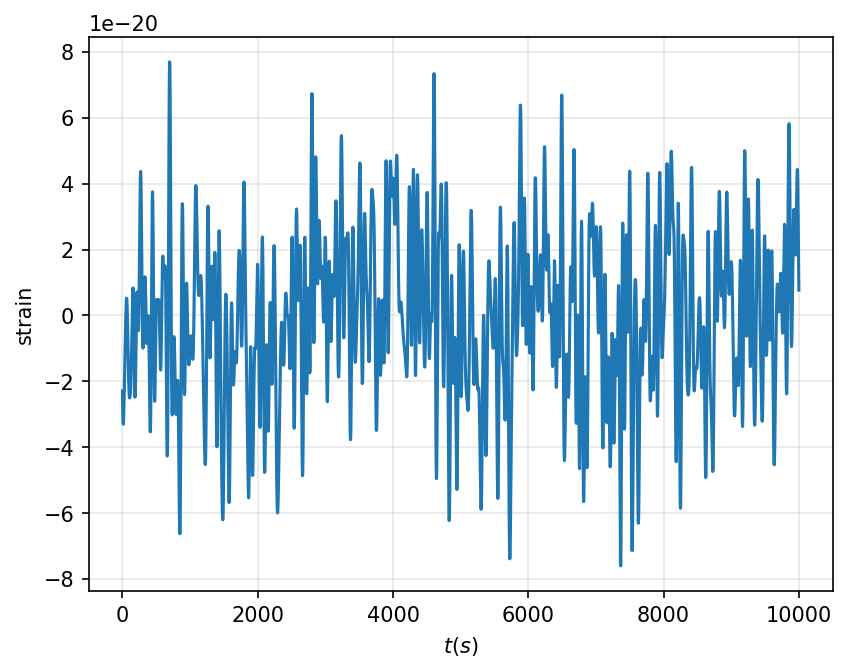

# datageneration

A micro package to generate a sampling of time series waveforms for Populations of White Dwarf binaries. For now we are generating test waveforms with each white dwarf system contributing a sinosoidal contribution to the time series. 

## Implemented Models:

#### Power Law in chirp mass and Power Law in seperation

$$p(\mathcal{M}_c, r | \alpha, \beta) \propto \mathcal{M}_c^{\alpha} r^\beta$$

## How to Use:

First lets define the limits of the truncation of the parameters of the waveform produced

```python
from datageneration import PowerLawChirpPowerLawSeperation
import numpy as np

## Define the ranges over which the population distribution exists

limits = {'chirp_mass':          [0.5, 1.4],  # In solar masses
          'seperation':          [0.5, 20],   # In 1e8 meters
          'luminosity_distance': [1, 50],     # In kilo parsecs
          'phase':               [0, 2*np.pi]}

## Instantiate the population distribution object

dist = PowerLawChirpPowerLawSeperation(limits=limits, 
                                       distance_power_law_index=1)   # p(d) ~ d
```

Now lets generate some samples from the above distribution

```python
# Get samples from a given hyperparameter set
import pandas as pd

Lambda = {'alpha' : 3.0, 'beta' : -2.0}
pd.DataFrame(dist.generate_samples(Lambda, size=10))
```

We can also generate a waveform with exactly `1_000` White Dwarfs drawn from the above distribution.

```python
Lambda = {'alpha' : 3.0, 'beta' : -2.0}
ts, strain = dist.generate_time_series(Lambda, N_white_dwarfs=1000)
dist.plot_time_series(ts, strain)
```


