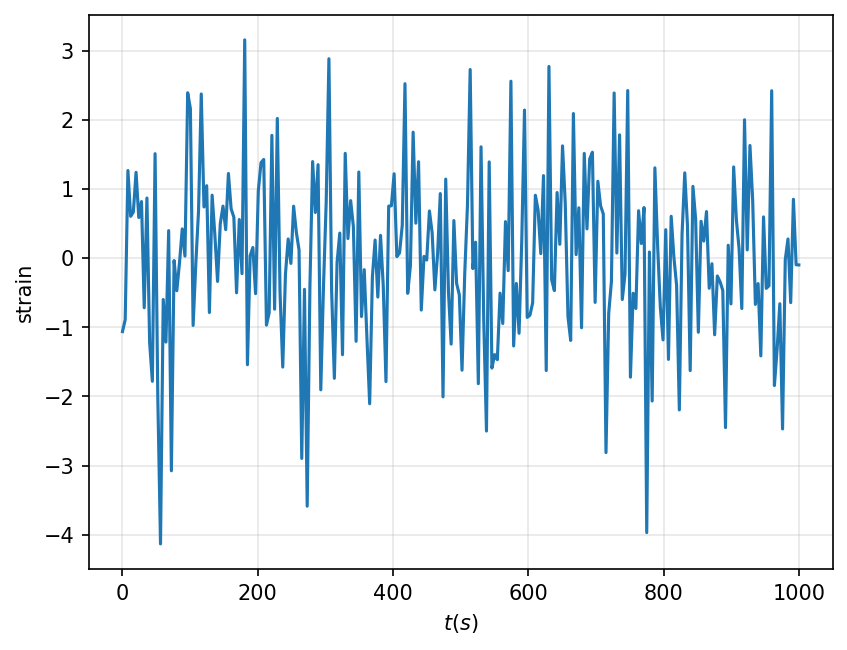

# datageneration

A micro package to generate a sampling of time series waveforms for Populations of White Dwarf binaries. For now we are generating test waveforms with each white dwarf system contributing a sinosoidal contribution to the time series. 

## Implemented Models:

#### Power Law in chirp mass and Power Law in seperation

$$p(\mathcal{M}_c, r | \alpha, \beta) \propto \mathcal{M}_c^{\alpha} r^\beta$$

## How to Use:

First lets import the white dwarf population model we want to use

```python
from datageneration import PowerLawChirpPowerLawSeperation
```

then, define the limits of the WD parameters

```python
import numpy as np

## Define the ranges over which the population distribution exists

limits = {'chirp_mass':          [0.5, 1.4],  # In solar masses
          'seperation':          [0.5, 20],   # In 1e8 meters
          'luminosity_distance': [1, 50],     # In kilo parsecs
          'phase':               [0, 2*np.pi]}

## Instantiate the population distribution object

dist = PowerLawChirpPowerLawSeperation(limits=limits, 
                                       distance_power_law_index=1,   # p(d) ~ d
                                       poisson=True) 			     # Total Number of sources should be drawn from poisson distribution
```

Now lets generate some samples from the above distribution

```python
# Get samples from a given hyperparameter set
import pandas as pd

Lambda = {'alpha' : 3.0, 'beta' : -2.0}
pd.DataFrame(dist.generate_samples(Lambda, size=10))
```
|    |   chirp_mass |   seperation |   luminosity_distance |    phase |
|---:|-------------:|-------------:|----------------------:|---------:|
|  0 |     1.27323  |     0.788449 |               33.239  | 5.78958  |
|  1 |     1.19709  |     2.26565  |               19.818  | 3.18277  |
|  2 |     0.915634 |     1.48249  |               42.2179 | 0.778479 |
|  3 |     1.088    |     0.584527 |               35.929  | 0.388221 |
|  4 |     1.26518  |     0.60876  |               11.8338 | 2.17972  |
|  5 |     1.36214  |     0.688372 |               13.0624 | 0.169574 |
|  6 |     1.21769  |     2.32083  |               43.8882 | 4.36302  |
|  7 |     0.612164 |     1.18939  |               14.558  | 2.17513  |
|  8 |     1.20729  |     0.653881 |               21.1689 | 0.489138 |
|  9 |     1.14561  |     0.75272  |               30.8705 | 3.76648  |

We can also generate a waveform with a large number of White Dwarfs drawn from the above distribution. In this case, we draw from a poisson distribution with mean `1000` to get the number sources actually produced to make up the signal.

```python
Lambda = {'alpha' : 3.0, 'beta' : -2.0}
ts, strain = dist.generate_time_series(Lambda, N_white_dwarfs=1000)
dist.plot_time_series(ts, strain)
```


# Custom Distributions:
You can also create your own distributions

```python
from datageneration import TruncatedPowerLaw, Uniform, Poisson, WhiteDwarfDistribution, SinosoidWaveform
import numpy as np

### Define a custom white dwarf population model. 


# Ingredient 1: Waveform model; The response of 1 single WD system. e.g. Sinosoid
# Give the amplitude, frequency and phase as a function of the system's parameters (A_0, d, f, phi)
waveform = SinosoidWaveform(
                            amplitude_model= lambda A_0,d : A_0/d,
                            frequency_model= lambda f : f,
                            phase_model= lambda phi : phi
                            )

# Ingredient 2: Population distribution; The distribution of system parameters in the universe
# Define a function that takes in a dictionary of hyper parameters (A_0 and alpha_f) and outputs a dictionary of distributions
def distribution_function(Lambda):
    return dict(A_0 = Uniform(0,Lambda['A_0']),
                  d = TruncatedPowerLaw(2,1,50),
                  f = TruncatedPowerLaw(Lambda['alpha_f'],10,100),
                phi=Uniform(0,2*np.pi))


# Put it together and instantiate the object
dist = WhiteDwarfDistribution(distribution_function=distribution_function,
                              waveform=waveform, poisson=False)

```

Now we can generate a waveform for this too

```python
t, strain = dist.generate_time_series({'A_0' : 3.0, 'alpha_f': -3.0}, N_white_dwarfs=1000, sample_rate=0.25, duration=1000)
dist.plot_time_series(t, strain)
```

